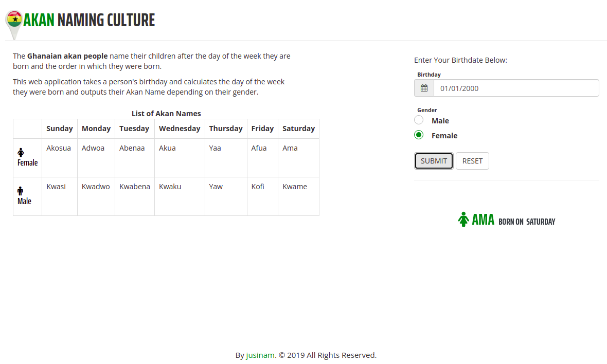

## Author
Evans Onchagwa

### Description
This web application takes a person's birthday and calculates the day of the week they were born and outputs their Akan Name depending on their gender.

### Akan Webpage

### Setup and installation requirements
- `git clone https://github.com/jusinam/akanpeople.git`
- `cd akanpeople`
- `code .` # (For Visual Studio Code text editor)
- `atom .` # (for Atom text editor)

### Languages used
1. JavaScript(jQuery 3.4.1)
2. HTML & CSS(Bootstrap)
3. Animate CSS

### Behaviour Driven Development
| Behavior | Input | Output |
|----------|-------|--------|
|1. Calendar and gender inputs displays | User's birthdate & gender is entered | User's Akan Name is displayed according to the submitted Date and Gender |
|2. Error Message displays if Date input is left blank | | Error Message displays |
|3. Error Message displays if Gender isn't not chosen | | Error Message displays |
|4. User inputs reset | Click Reset Button | Clears everything and resets the inputs |

<!-- 
### Development

Want to contribute? Great!

To fix a bug or enhance an existing module, follow these steps:
- Fork the repo
- Create a new branch (git checkout -b 'new-branch')
- Make the appropriate changes in the files
- Add changes to reflect the changes made
- Commit your changes (git commit -am 'new-branch')
- Push to the branch (git push origin 'new-branch')
- Create a Pull Request -->

### Live link
https://jusinam.github.io/akanpeople/

### Bugs
The formualae used is under sampling since it kind of displays wrong results to some inputs.

### Support and contact details
Incase of any questions, problems ideas concerning the application, feel free to reach out by email. (evans.program@gmail.com)

#### License
 *MIT LICENSE* © 2019 **Evans Onchagwa**

