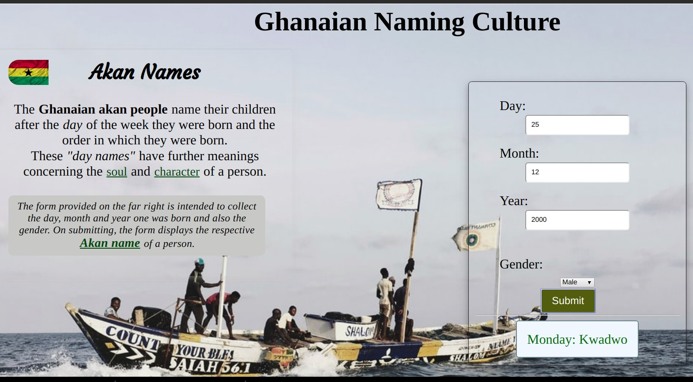

## Author
Evans Nyambane

### Description
This website describes what Akan names are and offers a form that allows the user to enter some details in order to display their day of the week and the name following Akan naming criteria.

### Languages used
1. JavaScript
2. HTML
3. CSS

### BDD
| Behavior | Input | Output |
|----------|-------|--------|
| The page loads | The user inputs the day, month, year and gender | The day of the week the user was born and the name |

### Live link
https://djcoogie.github.io/prep2project/

### Bugs
The formualae used is under sampling since it displays wrong results.

#### License
This project is Licensed under MIT. ©2019 Copyright.

### Akan Webpage

